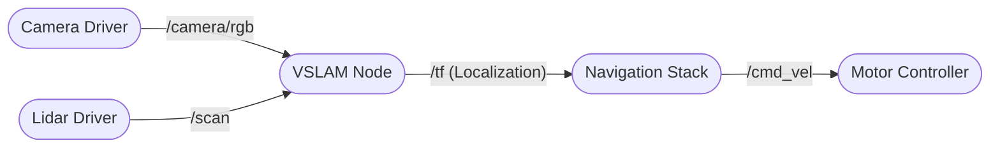

# Week 3-5: ROS 2 Fundamentals

## Topics
- **ROS 2 Architecture**: Why we switched from ROS 1 (DDS Middleware).
- **Core Concepts**:
  - **Nodes**: Independent processes performing computation.
  - **Topics**: Pub/Sub communication.
  - **Services**: Req/Res communication.
  - **Actions**: Long-running tasks with feedback.
- **Package Management**: Creating Python packages.
- **Launch Files**: Managing complex system startups.

## Lab
- Create a `py_pubsub` package.
- Visualizing data in `rviz2`.

## Architecture Visualization

A typical ROS 2 system consists of multiple nodes communicating via topics.

