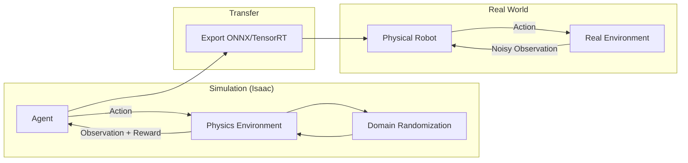

# Week 8-10: NVIDIA Isaac Platform

## Topics
- **Isaac Sim**: High-fidelity photorealistic simulation.
- **Isaac SDK**: Accelerated gems for navigation and perception.
- **VSLAM**: Visual Simultaneous Localization and Mapping.
- **Reinforcement Learning**: Training agents in Isaac Gym.
- **Sim-to-Real**: Domain Randomization techniques.

## Lab
- Set up Isaac Sim on the Workstation.
- Run the Carter Navigation tutorial.

## Sim-to-Real Pipeline

The process of transferring a policy learned in simulation to the real world.

